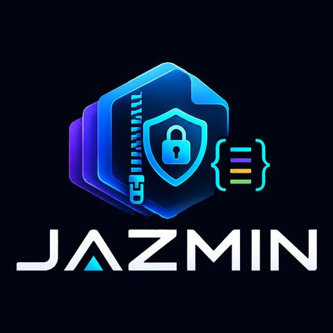

<p align="center"></p>

# JAZMIN

**Javascript Secure Zipped Multi Index Notation** is a compact, indexed,
optionally encrypted file format for lists of records, with libraries for
**JavaScript/TypeScript** and **.NET** that read and write the same files.

```js
// JavaScript
const bytes = JAZMIN.stringify(rows, { key });
const r = open('customers.jzm', { key });
for (const c of r.find({ country: 'ZA', name: { icontains: 'smith' } })) console.log(c);
```

```csharp
// .NET - shaped like Newtonsoft.Json, no third-party dependencies
byte[] bytes = JazminConvert.SerializeObject(customers, new() { Key = key });
using var reader = JazminReader.Open("customers.jzm", new() { Key = key });
var za = reader.Query<Customer>(c => c.Country == "ZA" && c.Name.Contains("Smith")).ToList();
```

Measured on 200,000 records (details and caveats in the user guide):

| Measure | Result |
|---|---|
| File size | About **24× smaller than JSON**, and 61% smaller than gzipped JSON (75% with Brotli) |
| Find a record by id | **55–139× faster** than System.Text.Json or Newtonsoft; **64× faster** than `JSON.parse` |
| Read a whole file | **2.8× faster** than System.Text.Json, 6.6× faster than Newtonsoft and 2.4× faster than `JSON.parse` |
| Memory per lookup | **178× less** than Newtonsoft (1.1 MB against 196 MB); under 0.1 MB in Node, against 42 MB for `JSON.parse` |
| Encryption | AES-256-GCM on every section, with a typo-safe key format and tamper detection, at near-zero extra cost |
| Conversion | Lossless JSON round trip, plus CSV and XML. **Export shapes** turn rows into nested JSON/XML (one entry per client with its transactions and totals), validated and streamed |
| Access control | One file, many keys: each access key sees only its rows and columns. Files are signed by the owner, and only the owner can update them |
| Time-limited access | Each key can expire (2 hours, 2 weeks, 5 years...). **Offline** keys are checked by the library; **online** keys also need an unlock token from your key service, which can require 2FA ([sample](dotnet/samples/Jazmin.KeyService)) |
| Updates | Full rewrite with `update()`, or fast **append-only** changes with `append()` and a `compact()` you control |
| Several tables | One file can hold several tables, like workbook sheets: client details once, transactions by client. Access follows the link |
| Viewer | Open `.jzm` files in a browser, as an installed app, a hosted page or one HTML file: the document, the data and the files, with any kind of key. Nothing is uploaded |
| Platforms | Node.js 22+ and TypeScript; .NET 10 (no third-party dependencies) |

Writing with indexes is slower than System.Text.Json, because the indexes are
built as the file is written. JSON remains the right choice for small API
payloads. The user guide shows the trade-offs.

## Install

```bash
npm install @smithsoft-studios/jazmin   # Node.js 22+ and TypeScript
dotnet add package Jazmin               # .NET 10
```

## Documentation

- [User guide](docs/USER-GUIDE.md): JavaScript, TypeScript and .NET examples; migrating from Newtonsoft; benchmarks; security
- [Format specification (RFC draft)](docs/rfc/draft-jazmin-format-03.md) and its [Protocol Buffers schema](spec/jazmin.proto)
- [Research summary](docs/RESEARCH.md): JSON/XML/CSV, BSON/MongoDB, Parquet, compression and cryptography
- [Security review package](docs/SECURITY-REVIEW.md): threat model, key hierarchy and the internal review's findings
- [Reporting a vulnerability](SECURITY.md)
- [Backlog](docs/TASKS.md) and [how to maintain and extend](docs/CONTRIBUTING.md)

## Quick commands

```bash
cd js && npm test && npm run typecheck          # JavaScript + TypeScript
cd dotnet && dotnet test                        # needs the .NET 10 SDK
JAZMIN_WRITE_FIXTURES=1 dotnet test             # also refresh the dotnet-*.jzm interop fixtures
npx @smithsoft-studios/jazmin --help           # the command-line tool: inspect, query, explain, advise, convert, keygen
```

## Licence

MIT: see [LICENSE](LICENSE).
